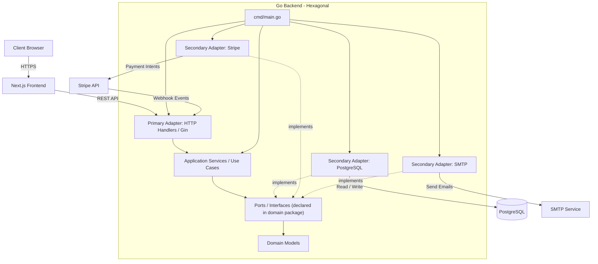

# Sleepiie Game Shop

A full-stack e-commerce platform for purchasing digital game keys. Built with modern web technologies focusing on performance, security, and a seamless user experience.

## System Architecture

The project is divided into two main components: a Next.js frontend and a Go backend structured using **Hexagonal Architecture**. The backend separates HTTP handlers, application use cases, domain ports, and infrastructure adapters. In this codebase, the port interfaces are declared in the `domain` package and wired to concrete adapters in `cmd/main.go`.

### Architecture Diagram



### Tech Stack
- **Frontend**: Next.js (React), TypeScript, Ant Design, Axios
- **Backend**: Go, Gin Web Framework, GORM, Argon2id (Password Hashing), JWT
- **Database**: PostgreSQL
- **Infrastructure**: Docker, Docker Compose
- **Third-party Services**: Stripe (Payments - PromptPay), SMTP (Email Notifications)

## Getting Started

You can run the application either using Docker (recommended for production/easy setup) or locally on your machine.

### Prerequisites
- [Docker & Docker Compose](https://docs.docker.com/get-docker/)
- [Node.js](https://nodejs.org/) (v20+ for local development)
- [Go](https://golang.org/) (1.24+ for local development)

### 1. Environment Configuration

Before starting the application, you must create an `.env` file at the root of the project. Copy the template from `.env.example` (if available) or create a new `.env` file with the following variables:

#### `.env` File Reference

| Variable | Description | Example Value |
|----------|-------------|---------------|
| **Server & Networking** | | |
| `PORT` | Port for the Go backend API | `8080` |
| `APP_ENV` | Application environment (`development` or `production`) | `production` |
| `NEXT_PUBLIC_API_URL` | The public URL of the backend API used by the frontend | `http://localhost:8080/api` |
| `CORS_ALLOW_ORIGINS` | Allowed origins for CORS (comma-separated) | `http://localhost:3000` |
| `FRONTEND_URL` | The URL of the frontend application (used in emails) | `http://localhost:3000` |
| **Database (PostgreSQL)** | | |
| `POSTGRES_USER` | Database username | `your_postgres_username` |
| `POSTGRES_PASSWORD` | Database password | `your_postgres_password` |
| `POSTGRES_DB` | Database name | `your_database_name` |
| `POSTGRES_HOST` | DB Host (use `localhost` for local run, `db` for Docker Compose) | `localhost` or `db` |
| `POSTGRES_PORT` | Database port | `5432` |
| **Security & Authentication** | | |
| `JWT_SECRET` | Secret key for signing JSON Web Tokens | `your-jwt-secret` |
| `JWT_REFRESH_SECRET` | Secret key for JWT refresh tokens | `your-refresh-secret` |
| `ENCRYPTION_KEY` | 32-byte key for encrypting game keys in the database | `Bxo7iJkFjPFafvtJaSeDiREb` |
| **Stripe (Payments)** | | |
| `STRIPE_SECRET_KEY` | Stripe secret API key | `sk_test_...` |
| `STRIPE_WEBHOOK_SECRET`| Stripe webhook signing secret | `whsec_...` |
| **Email (SMTP)** | | |
| `SMTP_HOST` | SMTP server host | `smtp.gmail.com` |
| `SMTP_PORT` | SMTP server port | `587` |
| `SMTP_USER` | SMTP username / email | `your-email@gmail.com` |
| `SMTP_PASS` | SMTP App Password | `your-app-password` |
| `FROM_EMAIL` | Sender email address | `your-email@gmail.com` |

---

### 2. Running with Docker Compose (Recommended)

This is the easiest way to spin up the entire stack, including the PostgreSQL database.

```bash
# Build and start all services in detached mode
docker compose up -d --build
```

The services will be available at:
- **Frontend**: `http://localhost:3000`
- **Backend API**: `http://localhost:8080/api`

*(Note: The database is not exposed to the host machine by default for security. If you need to connect via pgAdmin/DBeaver, map the ports in `docker-compose.yaml`).*

### 3. Running Locally (Without Docker)

If you prefer to run the services directly on your machine for development:

**Start the Database**
Ensure you have a PostgreSQL instance running locally with the credentials matching your `.env` file (`POSTGRES_HOST=localhost`).

**Start the Backend (Go)**
```bash
# The backend will automatically look for the .env file in the root directory
cd backend
go mod download
go run cmd/main.go
```

**Start the Frontend (Next.js)**
```bash
cd frontend
npm ci
npm run dev
```

## Security Features
- **Brute-force Protection**: Accounts are temporarily locked after 5 failed login attempts (15 mins), and permanently locked after 10 attempts (requires password reset via email). Email security alerts are sent automatically.
- **Data Encryption**: Digital game keys are encrypted at rest in the database using AES encryption.
- **Secure Authentication**: Passwords are mathematically hashed using Argon2id, and stateless sessions are managed via JWT.
- **Role-based Access Control (RBAC)**: Secure admin dashboard and protected API routes via middleware.
